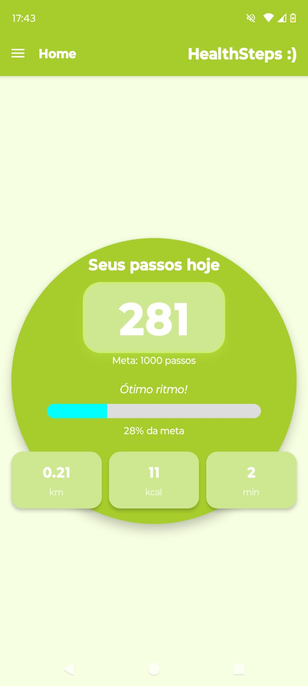
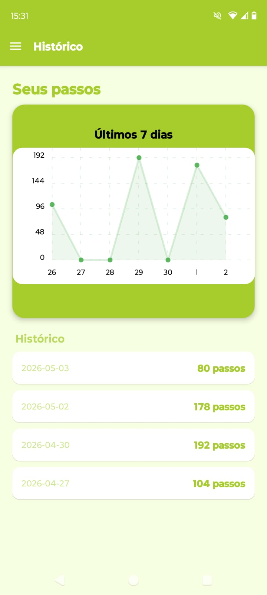
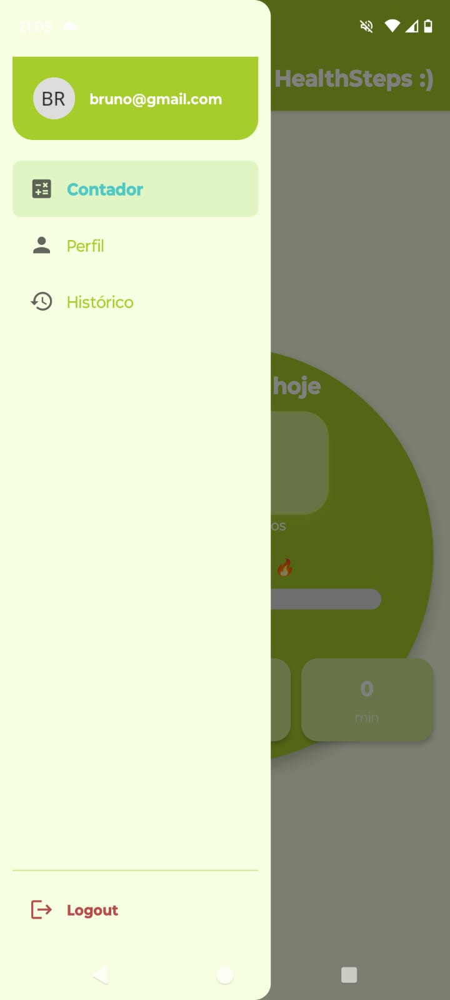
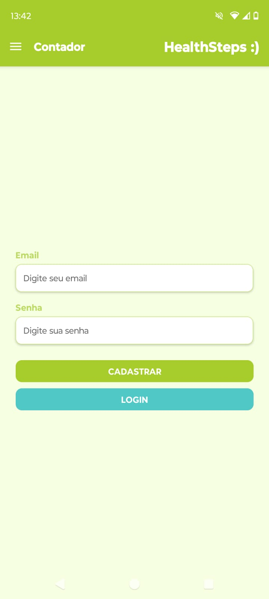

# 💚 HealthSteps :)

Aplicativo mobile desenvolvido com **React Native + Expo** para monitoramento de passos em tempo real utilizando o acelerômetro do dispositivo.

O app permite acompanhar metas diárias, visualizar histórico de atividades e salvar os dados automaticamente na nuvem com Supabase.


---

# 📱 Funcionalidades

- 🔐 Login e cadastro de usuários
- 🚶‍♂️ Contagem de passos em tempo real
- 🎯 Meta diária personalizada
- 📊 Barra de progresso estilo app fitness
- 📅 Histórico de passos
- 📈 Gráfico dos últimos 7 dias
- 👤 Tela de perfil com estatísticas
- 💾 Salvamento automático no banco
- ☁️ Integração com Supabase
- 💬 Frases motivacionais dinâmicas

---

# 🛠 Tecnologias utilizadas

- ⚛️ React Native
- 🚀 Expo
- 🧭 Expo Router
- 📡 Supabase
- 📱 Expo Sensors
- 📊 react-native-chart-kit
- 🎨 React Native StyleSheet

---

# 📂 Estrutura do projeto

```bash
app/
 └── (drawer)/
      ├── _layout.tsx
      ├── history.tsx
      ├── index.tsx
      └── profile.tsx

src/
 ├── components/
 │    ├── authForm/
 │    │    └── authForm.tsx
 │    │
 │    ├── home/
 │    │    ├── GuestHome.tsx
 │    │    └── LoggedHome.tsx
 │    │
 │    ├── motivationalMessages/
 │    │    └── motivationalMessages.tsx
 │    │
 │    ├── statsCards/
 │    │    └── statsCards.tsx
 │    │
 │    ├── stepsChart/
 │    │    └── stepsChart.tsx
 │    │
 │    └── stepsSensors/
 │    │    └── stepsCounter.tsx
 │
 ├── hooks/
 │    ├── useAuth.ts
 │    ├── useHistory.ts
 │    ├── useProfile.tsx
 │    ├── useStepCounter.ts
 │    └── useStepsChart.ts
 │
 ├── services/
 │    ├── steps.ts
 │    ├── supabase.js
 │    └── user.ts
 │
 └── constants/
      └── colors.js
```

---

# ⚙️ Como rodar o projeto

## 1. Instalar dependências

```bash
npm install
```

---

## 2. Configurar Supabase

Crie um arquivo:

```bash
src/services/supabase.js
```

Adicione:

```ts
import { createClient } from "@supabase/supabase-js";

export const supabase = createClient(
  "SUA_URL",
  "SUA_ANON_KEY"
);
```

---

## 3. Rodar o app

```bash
npx expo start
```

---

# 🧠 Como funciona

## 🚶 Contagem de passos

O aplicativo utiliza o acelerômetro do celular para detectar movimentação.

O sistema:

- calcula a magnitude do movimento
- remove gravidade do sensor
- detecta picos de movimento
- identifica passos
- evita duplicações com intervalo mínimo

---

## 💾 Salvamento automático

Os passos são salvos automaticamente no banco a cada 5 segundos.

Cada usuário possui:

- histórico individual
- metas personalizadas
- estatísticas próprias

---

# 🗄 Banco de dados

## Tabela: `steps`

| Campo   | Tipo |
| ------- | ---- |
| id      | uuid |
| user_id | uuid |
| date    | date |
| steps   | int  |

---

## Tabela: `profiles`

| Campo      | Tipo |
| ---------- | ---- |
| id         | uuid |
| goal_steps | int  |

---

# 🎯 Objetivo do projeto

O projeto foi desenvolvido para fins acadêmicos, aplicando conceitos de:

- Mobile Development
- Sensores IoT
- Arquitetura de aplicações
- Autenticação
- Banco de dados em nuvem
- Integração com APIs
- Organização em hooks/services/components

---

# 👨‍💻 Autor

Desenvolvido por **Bruno Firmino Torres**

---

# imagens do projeto
- Contador


- Histórico


- Menu lateral


- Perfil


- Login e cadastro

